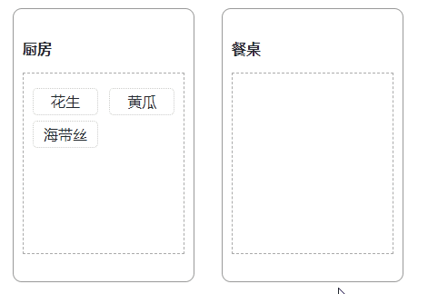

# React dnd Example


## drag/drop

* 单纯的`drag/drop`几乎没什么用，需要同时在两个不同的组件上使用这两个钩子
* 下面展示了一个上菜的过程，使用了`drag/drop/onDrop/dragging`等钩子或方法

### drag

```js
import { useDrag } from 'react-dnd'

const Snack = memo((props) => {
    const { children } = props

    useEffect(() => {
      return () => { }
    }, [children])

    // collector是一个对象，来源于 collect 方法的回参
  // drag 则为钩入一个 element，使 element 可 drag，应当使用 ref={drag} 或 drag(ref); ref={ref} 等方法
  // dragPreview 同上，不同的是，钩入的 element 为 preview div(即拖动时的预览效果)
    const [collector, drag, dragPreview] = useDrag(() => ({
      // 必须定义 drag type
      type: 'snack',    
      
      // 必须定义，可为一个 plainObj 或 function，如为function,则将在 beginDrag 时调用
      // 如为 function 时返回 null，则会被 cancel drag
      item: {           
        name: 'snack',
        content: children,
      },
      
      // dragPreview 的配置
      previewOptions: {},
      
      // drag 的配置
      options: {
        // 该效果会在 drop 时影响鼠标的显示效果（不同的鼠标图标）
        dropEffect: 'move', // move/copy
      },
      
      // todo 还不知道是 begin 还是 beginDrag 亦不知实际用法
      beginDrag: () => {
        return {
        }
      },

      // drag 结束。通常也可在此安排一个 monitor.didDrop() 来检查 drag 行为是否有被相关的 drop 程序处理，
      // 如一个 drop target 有在相关的 drop evt 返回 drop result，则可在此调用 monitor.getDropResult() 来获取结果
      // 通常也会在此安排 flux/redux action
      // **注意**：值得一提的是，在此的 getDropResult().dropEffect === 'copy/move' 可根据这个参数来选择不同的业务
      end: (item, monitor) => {
        // item: dragSource.item 设置
        // monitor.getDropResult() 通常如果要处理 drop 事件，会在 end 中处理 getDropResult 对象
        // monitor.didDrop() 如果有相关的 drop evt 处理函数
      },

      // 如果你要使一个 dragSource 一直可 drag，则没有必要设置这个配置
      // 通常你可以使用 props 来决定 return true/false，在这里, monitor.canDrag 是不被允许的
      canDrag: (monitor) => {
        return true  // or false
      },
      
      // todo 还不清楚这个的实际用法
      isDragging: (monitor) => {
      },

      // 收集函数, 返回一个 object，包含一些计算好的内容以供使用(collector)
      collect: (monitor) => { 
        monitor.isDragging()    // true/false
        monitor.canDrag()       // true/false
        monitor.getItemType()   // 返回 dragSource的 type
        monitor.getItem()       // 返回 item 内容
        monitor.getDropResult() // drop target 处理完 drop 后返回的内容
        monitor.didDrop()       // 是否已经有程序处理了 drop 事件
        // 这里返回的内容
        monitor.getHandlerId()  // drag 为每一个 drag source 都定义了一个 handlerId
        return {
          isDragging: !!monitor.isDragging(),
        }
      }
    }), []) // 注意，如果要在 useDrag 处理一些外部的变量，则应该在此 deps 添加变量的依赖，参考 useMemo 来提升计算、渲染的性能

    const { isDragging } = collector
    const cls = 'snack' + (isDragging ? ' dragging' : '')

    return (<div className={cls} ref={drag}>
      {children}
    </div>)
  }
)
```

* **注意**，一旦产生了`drag/drop`，势必会引起`drag source/drop target`在函数层面及`useEffect`的重渲染
* 要注意在这些方法规避一些重复渲染的问题，合理使用`useMemo/useCallback/memo`等来提升渲染性能；
* 并且使用 `useEffect.deps[]`来规避`useEffect`的调用
* **注意**，`useDrag(fun, deps)`，中，如果在`fun`中处理一些可变的、用于渲染的变量，则需要在`deps`中添加此依赖

### drop

```js
import { useDrag, useDrop } from 'react-dnd'

const Desk = memo((props) => {
    const [contents, setContents] = useState([])
    const ref = useRef(null)

    useEffect(() => {
      return () => { }
    }, [])

    // collector是一个对象，来源于 collect 方法的回参
    // drop 则为钩入一个 element，使 element 可 drop，应当使用 ref={drop} 或 drop(ref); ref={ref} 等方法
    // 如使用 drop(ref) 方法时，可使用 drag(drop(ref)) 来完成 drag/drop 事件的双重绑定
    const [dropCollector, drop] = useDrop(
      () => ({
        // 可为 string 或 数组 或函数（须返回 string/[string...])
        accept: 'snack',

        //
        options: {
          // 据说可以使用这个配置，来判断当前的 props 与之前的 props （或某个时段的 props)
          // 判断这个属性，以获取性能上的提升
          arePropsEqual: (props, otherProps) => {
          }
        },

        // 同样的，如果你想一直可 drop 则没有必要设置此
        // 相反，如果你想通过props 或 dragObj 来判断一些业务状态下返回 true/false，则非常合适
        // 同样的，你不能在此方法内调用 monitor.canDrop
        canDrop: (dragObj, monitor) => {
          return true
        },

        // drop 配置可能是 drop 方法中最高频的配置
        // dragObj 为 dragSource 中的 item
        // dropTargetMonitor 不同于 dragSourceMonitor 有着不同的方法
        drop: (dragObj, monitor) => {
          // 1. 通常来讲，如果你配置了 canDrop 并通过一些判断返回 false,则此方法不被调用
          // 2. 如果你有嵌套的 dropTarget，想象一个 drop 房间有个 drop 墙，上面有个 drop 桌子
          //    当 drop 桌子处理了一个 drop 事件，可以在此方法内调用
          //    monitor.didDrop() 来判断是否有 dropTarget 处理了 drop 事件，以做下一步业务的处理
          //    你还可以使用 monitor.getDropResult() 来做更复杂的判断，这非常重要！
          // 3. 同 dragSource 中的 endDrag，此方法内非常适合做 redux action !
          // 4. 此方法 return sth 而 sth 则会成为 dropResult() 的内容，注意不能返回 false，
          //    否则在嵌套的 dropTarget 中判断不了 didDrop() （当然你甚至可以利用这点来做复杂的业务）
          monitor.getInitialClientOffset()              // 开始drag时，指针相于window的位置信息 {x, y}
          monitor.getClientOffset()                     // dragging过程中，指针相于window的位置信息 {x, y}
          monitor.getInitialSourceClientOffset()        // 开始drag时，dragSource 相对于 window 的位置信息 {x, y}
          monitor.getDifferenceFromInitialOffset()      // 计算当前指针的位置信息与 dragSource 的**之前的位置**的差值 {x, y}，通常用这个值来计算box内的element移动量
          monitor.getSourceClientOffset()               // 结束drag时，dragSource 相对于 window 的位置信息 {x, y}

          setContents(contents.concat([dragObj.content]))

          return {
            value: 'from drop source'
          }
        },

        // hover 事件，不同于 drop ，即使当前的 dropSource.canDrop() === false
        // 该事件一旦 hover 会频繁触发，适合用来做排序功能
        hover: (dragObj, monitor) => {
          console.error(dragObj)
        },


        // collect 返回一个对象，对象的内容对应着 useDrop 的回参的第一个参 collector
        collect: (monitor) => {
          monitor.isOver()      // 是否有 dragSource over
          monitor.isOver({
            shallow: true  // true/false 利用这个属性来查看是否在嵌套的 dropTarget 上运行
          })
          monitor.canDrop()     // 查看当前的 dragSource 的 type 是否在 accept 的范围内
          return {
            isOver: !!monitor.isOver(),   // 是否被
          }
        }
      }), [contents]
    )

    const { isOver } = dropCollector

    drop(ref)

    return (<div className={'desk-item' + (isOver ? ' over' : '')} ref={ref} id={'deskItem'}>
      {
        contents.map((item, index) => (
          <div key={index}>{item}</div>
        ))
      }
    </div>)
  }
)
export default Desk

```

* **注意**，与`drag`一致，`hover/drop`等行为会引起 `re render`，注意使用`useMemo/memo/useCallback`等钩子去合理地规避一些无效渲染
* **注意**，与`drag`一致，使用 `useDrop(spec, deps)`中的`deps`来指定一些在`fun`中处理的可变，用于渲染的变量，原因参考`useMemo`



