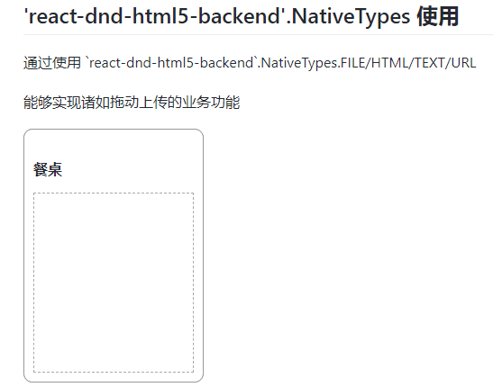

# react-dnd-html5-backend.NativeTypes

* `react-dnd-html5-backend`提供了一个`NativeTypes`对象，来提供一些可被`drag/drop`的原生对象，如：
* `NativeTypes.FILE/HTML/TEXT/URL`
* 通过上述的类型，能够实现诸如拖动上传的业务功能，或是快速复制文本内容等操作


```js
useDrop(() => ({
  accept: [NativeTypes.FILE, NativeTypes.HTML, NativeTypes.TEXT, NativeTypes.URL],
}))
```


