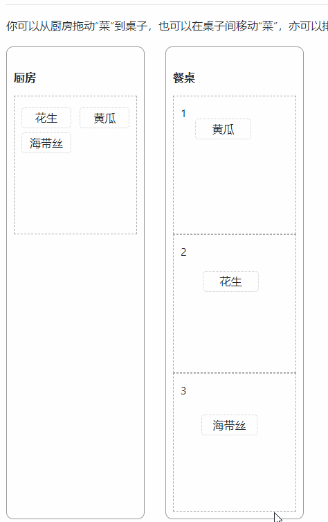
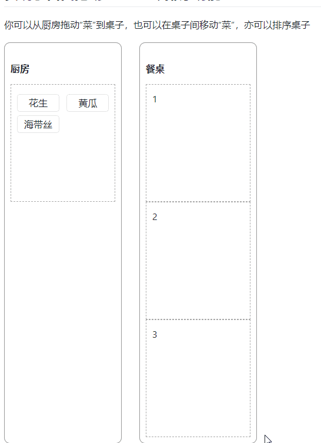

# react dnd 实现排序与自由拖动

## 排序

* 实际上，排序功能需要排序的对象同时实现`drag/drop`功能，实现了需要排序的对象在同属性对象上的`drop`时
* 通过位置判断实现`index`索引的调换

```js
// 1. 首先实现 drag 拖动，在此设置中，重要的是 item 中包含当前对象的 index
// 2. deps注意设置相关的依赖对象
const [dragCollector, drag, dragPreview] = useDrag(() => ({
  type: 'desk',
  item: {
    name: 'desk',
    id,
    index
  },
  collect: (monitor) => {
    return {
      isDragging: !!monitor.isDragging(),
    }
  }
}), [deps])


// 1. 实现drop 钩子，注意，此时的accept 须包含本身的的type
// 2. 由于我们需要在 hover 时进行排序，所以相关的逻辑应该写在 hover 中而非 drop
const [dropCollector, drop] = useDrop(
  () => ({
    accept: ['desk'],

    drop: (dragObj, monitor) => {
    },

    // 3.1 hover 中，当 ref.current 才可进行操作，这是为了防止排序时丢 current 对象做的策略（render更像是异步进行的）
    hover: (dragObj, monitor) => {
      if (!ref.current) {
        return;
      }

      const dragIndex = dragObj.index
      const hoverIndex = index

      // 3.2 当 hover 对象是本身是，return，（为何会是本身？因为 drapSource 本身是“不移动”的，移动的只是浏览器渲染出来的一个”假象“，要注意这个点
      if (dragIndex === hoverIndex) {
        return;
      }

      // 被 hover 的对象在文档中的高度的一半: hoverMiddleY
      const hoverBoundingRect = ref.current?.getBoundingClientRect();
      const hoverMiddleY = (hoverBoundingRect.bottom - hoverBoundingRect.top) / 2;

      // 指针相对于文档中的位置（右上角 x:0, y:0 的原点）
      const clientOffset = monitor.getClientOffset();

      // 计算指针相对于文档中的位置y，减去 hoverTarget 的位置 y，得到他们的差值
      const hoverClientY = clientOffset.y - hoverBoundingRect.top;

      // Only perform the move when the mouse has crossed half of the items height
      // When dragging downwards, only move when the cursor is below 50%
      // When dragging upwards, only move when the cursor is above 50%

      // 如果是把列表上面的 item 排到下面的 item，但 指针位置还超过 hover 对象在文档中的中间位置，则返回
      // 比如 A, B, C, 将 A 拖到 B处，此时若计算出 hover 位置还不超时 hoverTarget 的中间位置，则不允操作
      if (dragIndex < hoverIndex && hoverClientY < hoverMiddleY) {
        return;
      }

      // 如果是把列表下面的 item 排到上面的 item，但 指针位置还没小于 hover 对象在文档中的中间位置，则返回
      // 原理同上
      if (dragIndex > hoverIndex && hoverClientY > hoverMiddleY) {
        return;
      }

      // 以上条件都满足后，进行位置更换：
      const n = update(desks, {
        $splice: [
          [data.dragIndex, 1],
          [data.hoverIndex, 0, desk],
        ],
      })

      // 这里，最重要的还是做这一步，因为 hover 是在不断地产生 hover 事件了，如果此时调换了,
      // 比如 0 换到 1 的位置，此时，hoverIndex 还是为1，但是 dragIndex 还是为 0
      // 那就会变成 0 和 1 的状态下，永远都处于 update 的状态下
      // 所以及时地将 dragObj.index = hoverIndex, 即让 1 : 1，则调换过一次后，就会 return
      // 实现完成的 re order 
      dragObj.index = hoverIndex;
    },
  }), [updateDesks, props]
)
```

```jsx
// 注意以下的 key={o.id} 以往我们都是使用 key={index} ，key 在 react/vue 中的 list 中都是
// 为了快速引用该 element ，但在排序中， index 是改变的，然而 element 除了位置外，其他不变
// 所以使用 id 来做唯一的 key 值，这在一定程序上能规避很多渲染上的 bug
{
  desks.map((o, i) => {
    return (<Desk key={o.id} index={i} id={o.id} items={o.items} updateDesks={updateDesks}/>)
  })
}
```



## 自由拖动

* 自由拖动无非是通过计算“指针位置”与“容器位置”来计算“absolute:left/top”的位置
* 以及通过操作数组，即`push/splice/merge array`的方式来实现“拖动”

```js
const [dropCollector, drop] = useDrop(
  () => ({
    drop: (dragObj, monitor) => {

      // 判断 action
      if (dragObj.role === 'source') {
        let action = 'add'
      }
      else {
        let action = 'move'
      }

      // 获取 father 位置
      const { x: fatherX, y: fatherY } = ref.current.getBoundingClientRect()
      // 获取指针位置
      const { x: pointX, y: pointY } = monitor.getSourceClientOffset() || { x: 0, y: 0 }
      // 一般来讲，如果你的页面有 scroll，还要获取以下间位置，如你的父的父的父等，有 scroll，可能还需要计算这些位置！
      const { scrollTop, scrollLeft } = window.document.documentElement
      // 偏移量，根据经验设置即可
      const pad = 3
      const left = Math.round(pointX - fatherX + scrollLeft + pad)
      const top = Math.round(pointY - fatherY + scrollTop - pad - document.documentElement.scrollTop)

      if (dragObj.role === 'source') {
        // 计算父的位置，与当前 dragSource 的位置，来计算出 dragSource 在父中应该的位置
        updateDesks({
          action: 'add',    // add/move
          deskIndex: index, // 目标 父位置
          fromDeskIndex: dragObj.deskIndex,   // 来源 父位置，如果是新增，则为 -1，如果是同局移动，则 fromIndex === targetIndex
          index: dragObj.index,                // 本身位置，用于 splice 等，如为同局移动，则用于 $merge left/top
          value: {
            content: dragObj.content,
            position: 'absolute',
            left, top
          }
        })
      }


      return {
        value: 'from drop source'
      }
    },
  }), [updateDesks, props]
)

if (data.action === 'add') {
  const n = update(desks, {
    [data.deskIndex]: {
      items: {
        $push: [data.value]
      }
    }
  })
  setDesks(n)
}

// action 的处理共有三种处理
// 1. 如果是新增，简单的 push 即可
const n = update(desks, {
  [data.deskIndex]: {
    items: {
      $push: [data.value]
    }
  }
})

// 2. 如果是同个父对象的移动，只需要 merget: left/top
const n = update(desks, {
  [data.fromDeskIndex]: {
    items: {
      [data.index]: {
        $merge: data.value
      }
    }
  }
})

// 3. 不同父对象的移动是比较复杂的，需要 splice 后 再 push
const n = update(desks, {
  [data.fromDeskIndex]: {
    items: {
      $splice: [[data.index, 1]]
    }
  },
  [data.deskIndex]: {
    items: {
      $push: [data.value]
    }
  }
})
```


